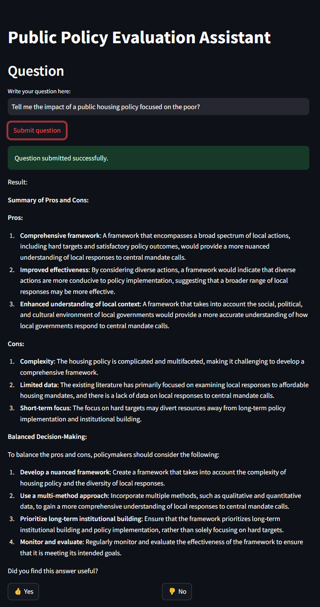

# public-policy-evaluation-assistant

# RAG Flow for Housing Policy Public Consultation Assistant

This project implements a *Retrieval-Augmented Generation* (RAG) flow aimed at developing an expert assistant focused on housing public policy. The assistant is designed to provide verified information about housing policies, highlighting the pros and cons of various proposals to facilitate balanced, well-informed decision-making.

## Project Objective

The main goal is to create a support system for policymakers and public policy professionals, enabling them to obtain accurate, objective summaries on the impact of various housing policies. This assistant leverages relevant data (academic articles, government reports, etc.) and generates structured responses covering the positive and negative aspects of each policy.

## Key Features

- **Verified Information Querying**: The assistant uses a RAG flow to retrieve and synthesize relevant data in response to specific questions about housing policies.
- **Structured Pros and Cons**: Each response includes a summary of the policy's pros and cons, ensuring a balanced and neutral focus.
- **Professional, Objective Tone**: Designed to provide accurate information without additional assumptions or extrapolations beyond the context.

## Notebooks

### Notebook Summary: [01_chunk_articles.IPYNB](https://github.com/alonmar/public-policy-evaluation-assistant/blob/main/notebooks/01_chunk_articles.ipynb)

This notebook is designed to process PDF files, convert them to text, split the text into smaller chunks, and save these chunks as JSON files

### Notebook Summary: [02_search_and_index_implemantation.ipynb](https://github.com/alonmar/public-policy-evaluation-assistant/blob/main/notebooks/02_search_and_index_implemantation.ipynb)

This Jupyter Notebook demonstrates the process of setting up and utilizing a search and indexing system using Elasticsearch and Sentence Transformers

### Notebook Summary: [03_build_ground_truth_data.IPYNB](https://github.com/alonmar/public-policy-evaluation-assistant/blob/main/notebooks/03_build_ground_truth_data.ipynb)

This notebook is designed to build ground truth data for a policy advisory system using machine learning models.

### Notebook Summary: [RAG_evaluation.ipynb](https://github.com/alonmar/public-policy-evaluation-assistant/blob/main/notebooks/RAG_evaluation.ipynb)

The Jupyter Notebook `retrieval_evaluation.ipynb` is designed to evaluate the performance of a retrieval system using Elasticsearch and Sentence Transformers.

### Notebook Summary: [retrieval_evaluation.ipynb](https://github.com/alonmar/public-policy-evaluation-assistant/blob/main/notebooks/retrieval_evaluation.ipynb)
Is a Jupyter Notebook that contains code to evaluate a Retrieval-Augmented Generation (RAG) system.

## Usage Example

To query a specific housing policy, the user can ask a question such as, “What are the pros and cons of implementing rent control policies in urban areas?”

The assistant will generate a response based solely on verified contextual information, presenting a clear summary of pros and cons to support decision-making.

## Requirements

- **Python 3.10+**
- **Libraries**:
  - `transformers` for the language model
  - `pandas` and `numpy` for data manipulation
  - `scikit-learn` for additional text processing techniques

# Run Local
## Installation Instructions


First, you need to initialize Elasticsearch by running:

```
python app\elasticsearch_prep.py
```

To run the app and start sending queries, navigate to the `/app` directory:

```
cd /app
```

Then execute:

```
streamlit run .\app.py
```

and visit:

```
http://localhost:8501/
```

And you can start to ask




# Run Docker

```
docker compose up
```

visit


```
http://localhost:8501/
```
